# SerialGC gc日志解读（GCEasy）
```
VM options: 
-XX:+UseSerialGC -Xms512m -Xmx512m -XX:+PrintGCDetails -XX:+PrintGCDateStamps -Xloggc:02jvm_2/gc_log/serialGC.log
```
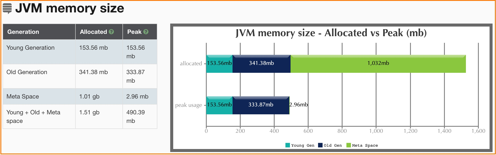
实际jvm分配的年轻代大小为：153.56m，使用到内存的峰值为153.56m；
实际jvm分配的老年代代大小为：314.38m，使用到内存的峰值为333.87m；
因为电脑本身内存16G，元空间默认分配大小1/16，1G。

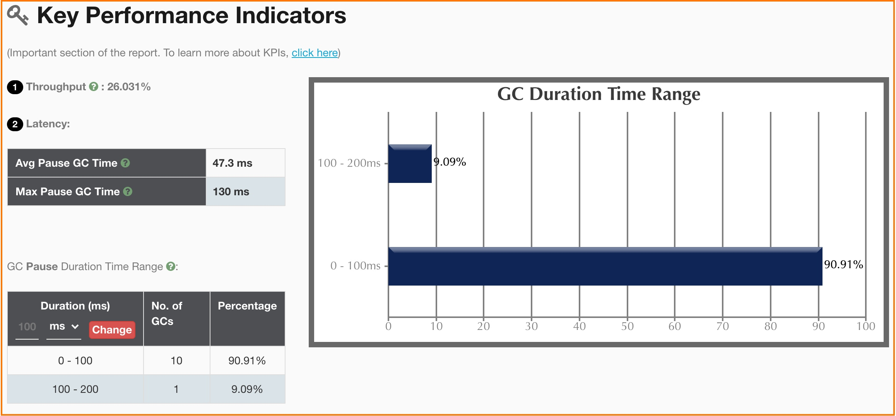
总GC次数11次，其中有10次STW时间在100ms以内，有一次gc时间在100-200ms之间。

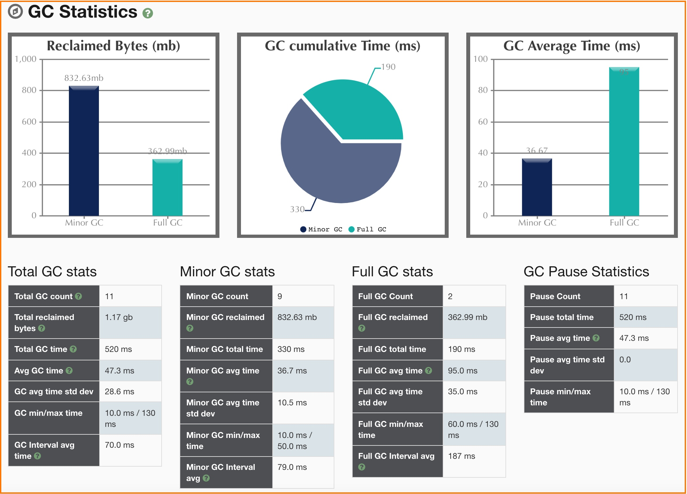
YoungGC总共回收内存达832.63mb,总耗时330ms，平均耗时36.67ms；
FullGC总共回收内存达362.99mb,总耗时190ms，平均耗时95ms；

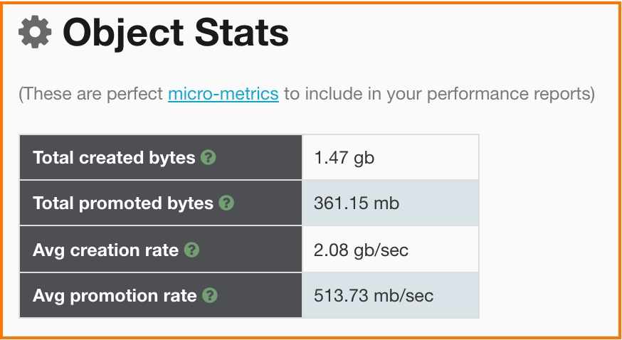
应用总创建的字节数为1.47gb；其中有361.15mb大小的数据从年轻代晋升到了老年代；应用中对象创建的平均速率为2.08gb/sec；平均晋升速率513.73mb。

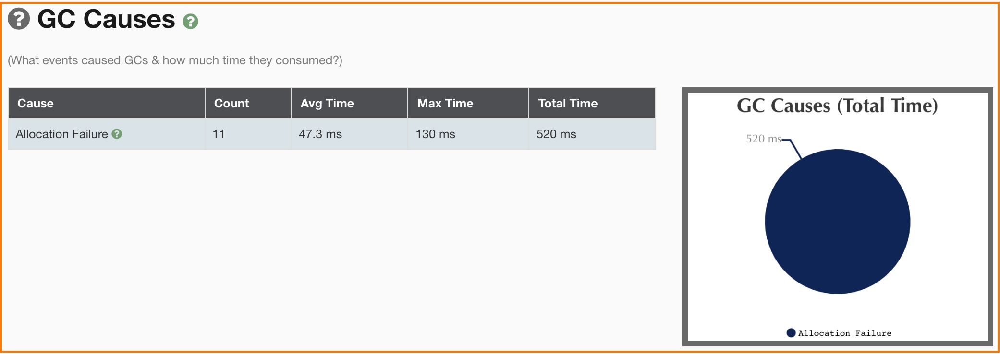
由于内存分配失败导致的GC，一共11次，平均gc时间47.3ms，最大gc时间130ms，总gc时间520ms。

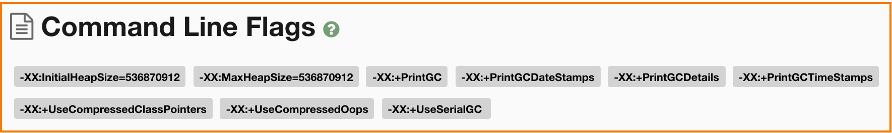
该应用启动的时候所使用的命令行参数。

# Parallel gc日志解读（GCEasy）
```
VM options: 
-XX:+UseParallelGC -Xms512m -Xmx512m -XX:+PrintGCDetails -XX:+PrintGCDateStamps -Xloggc:02jvm_2/gc_log/parallelGC.log
```
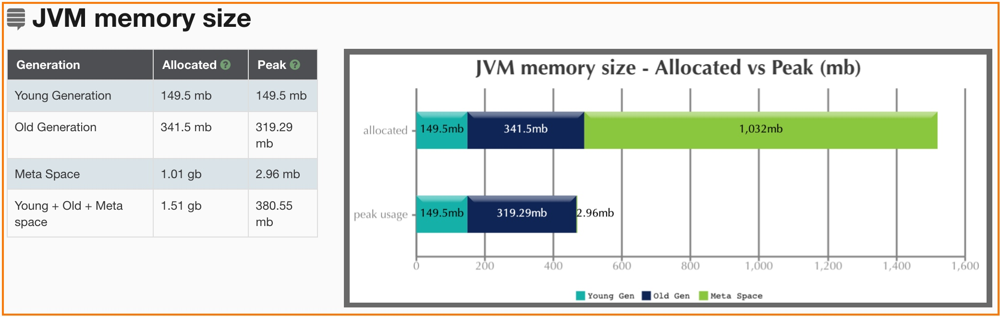
实际jvm分配的年轻代大小为：149.5m，使用到内存的峰值为149.5m；
实际jvm分配的老年代代大小为：341.5mb，使用到内存的峰值为319.29m；
因为电脑本身内存16G，元空间默认分配大小1/16，1G。

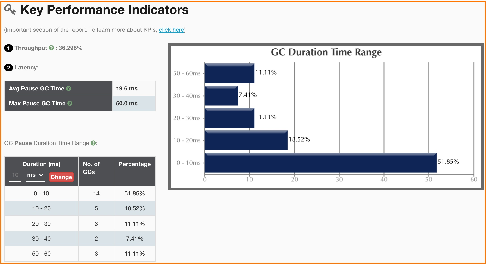
总GC次数27次，gc耗时分布如图，gc的平均暂停时间19.6ms，最大GC暂停时间50ms。

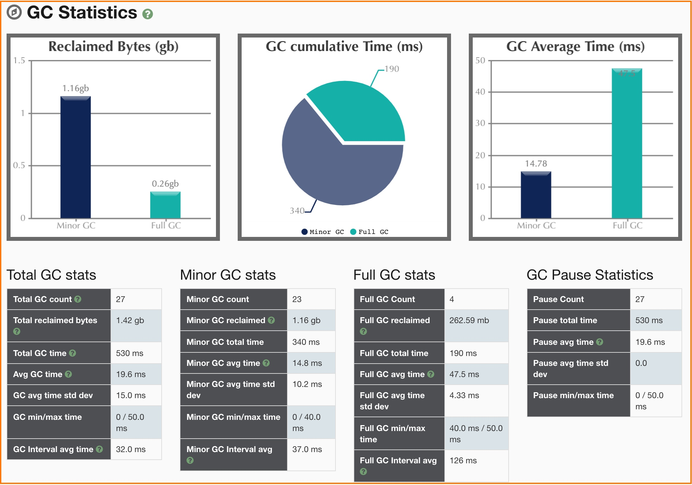
YoungGC总共回收内存达1.16gb,总耗时340ms，平均耗时14.78ms；
FullGC总共回收内存达0.26gb,总耗时190ms，平均耗时47.5ms；

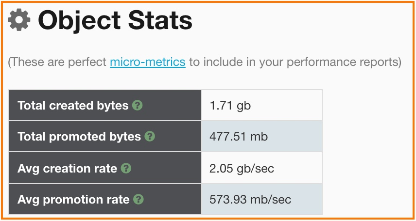
应用总创建的字节数为1.71gb；其中有477.51mb大小的数据从年轻代晋升到了老年代；应用中对象创建的平均速率为2.05gb/sec；平均晋升速率573.93mb。

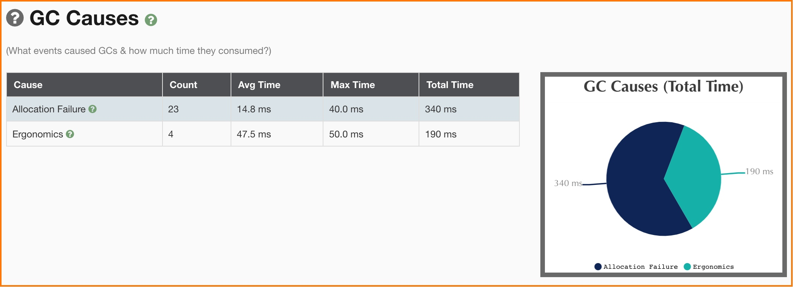
由于内存分配失败导致的GC，一共23次，平均gc时间14.8ms，最大gc时间40ms，总gc时间340ms;
jvm内存动态调整出发的GC有4次，平均gc时间47.5ms，最大gc时间50ms，总gc时间190ms;
> GC eergonomics tries to grow or shink the heap dynamically to meet a specified goal such as minimum pause time and/or throughput.

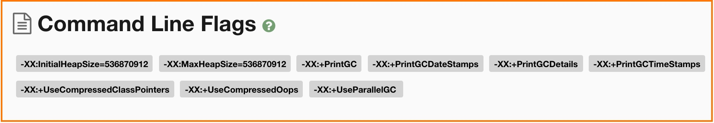
该应用启动的时候所使用的命令行参数。

# CMSGC gc日志解读（GCEasy）
```
VM options: 
-XX:+UseConcMarkSweepGC -Xms512m -Xmx512m -XX:+PrintGCDetails -XX:+PrintGCDateStamps -Xloggc:02jvm_2/gc_log/cmsGC.log
```
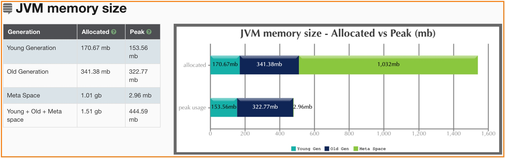
实际jvm分配的年轻代大小为：170.67m，使用到内存的峰值为153.56m；
实际jvm分配的老年代代大小为：341.38mb，使用到内存的峰值为322.77m；
因为电脑本身内存16G，元空间默认分配大小1/16，1G。

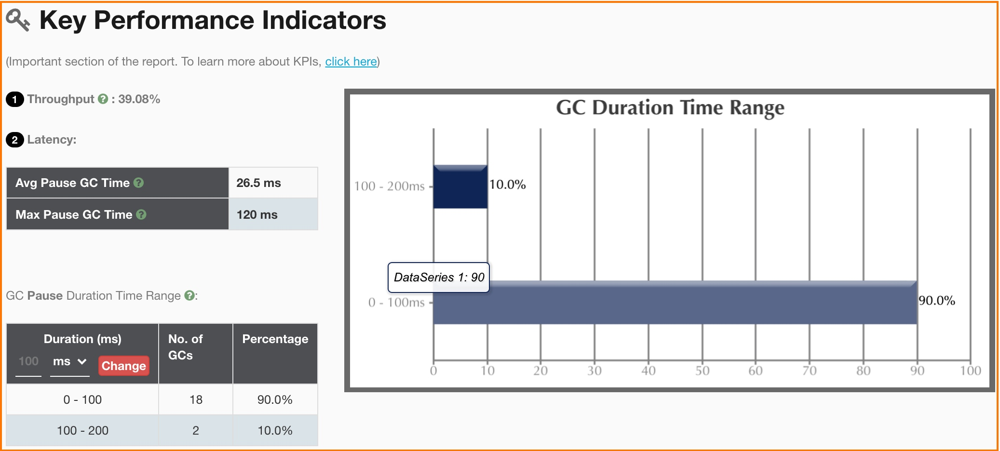
总GC次数20次，gc耗时分布如图，gc的平均暂停时间26.5ms，最大GC暂停时间120ms。

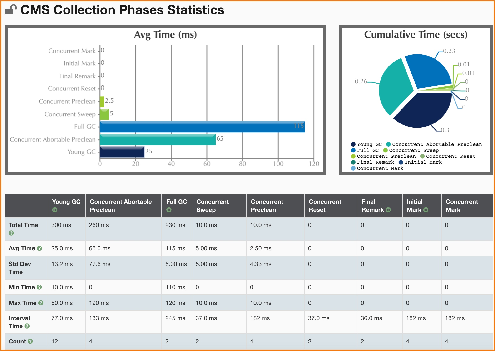
CMS GC进行垃圾清除一共分为6个阶段：
阶段1:Initial Mark（初始标记）
阶段2:Concurrent Mark (并发标记)
阶段3:Concurrent Preclean （并发预清理）
阶段4:Final Remark （最终标记）
阶段5:Concurrent Sweep （并发清除）
阶段6:Concurrent Reset （并发重置）

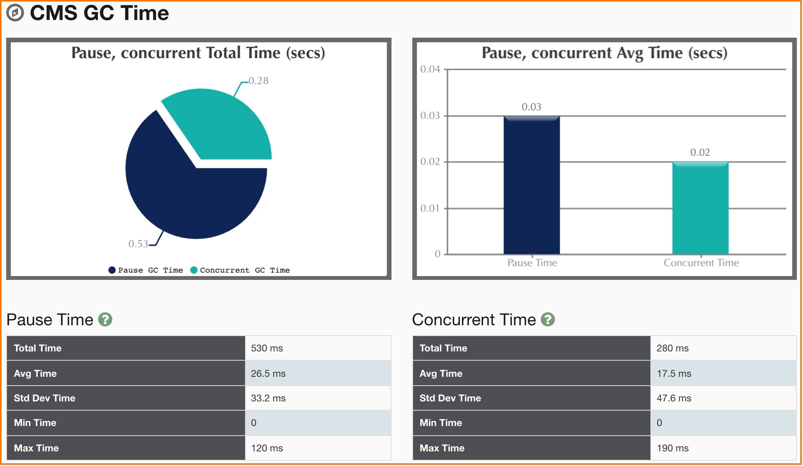

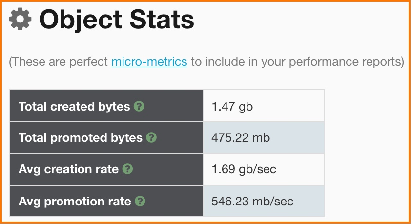
应用总创建的字节数为1.47gb；其中有475.22mb大小的数据从年轻代晋升到了老年代；应用中对象创建的平均速率为1.69gb/sec；平均晋升速率546.23mb。

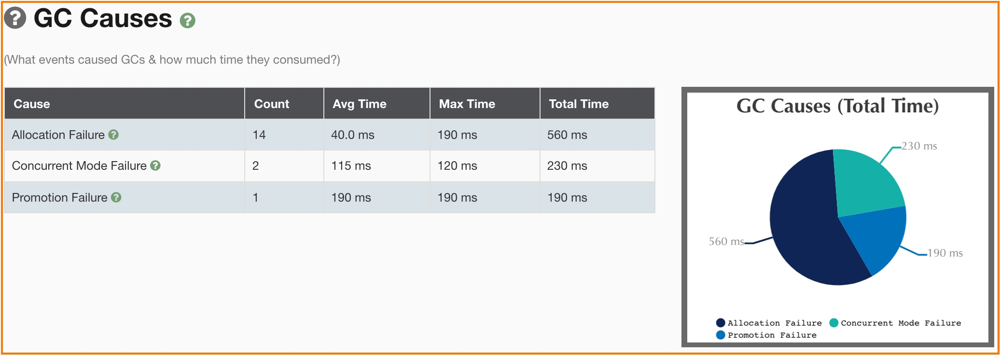
由于内存分配失败导致的GC，一共14次，平均gc时间40.0ms，最大gc时间190ms，总gc时间560ms;
由于`Concurrent Mode Failure`导致的GC，一共2次，平均gc时间115ms，最大gc时间120ms，总gc时间230ms;
由于对象晋升失败导致的GC，一共1次，平均gc时间190ms，最大gc时间190ms，总gc时间190ms;
> Concurrent Mode Failure: The CMS collector uses one or more gargage collector threads that run simultaneously with the application threads  with the goal of completing the collection of the old generation before it becomes full. CMS collector does most of its tracing and sweeping work with the application threads still running, so only brief pauses are seen by the application threads. However, if the CMS collector is unable to finish reclaiming the unreachable objects before the old generation fills up, or if an allocation cannot be satisfied with the available free space blocks in the old generation, then the application is paused and the collection is completed. The inability to complete a collection concurrently is referred to as concurrent mode failure and indicates the need to adjust the CMS collector parameters. Concurrent mode Failure typically triggers Full GC.
> Promotion Failure happens when there is no continuous memory space to promote larger object, even though total free memory is large enough. This problem is called as heap fragmentation. Promotion Failure typically triggers Full GC.

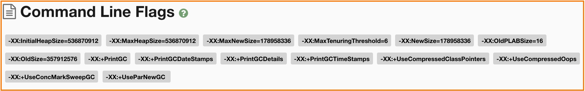
该应用启动的时候所使用的命令行参数。

# G1 gc日志解读（GCEasy）
```
VM options: 
-XX:+UseG1GC -Xms512m -Xmx512m -XX:+PrintGCDetails -XX:+PrintGCDateStamps -Xloggc:02jvm_2/gc_log/g1GC.log
```
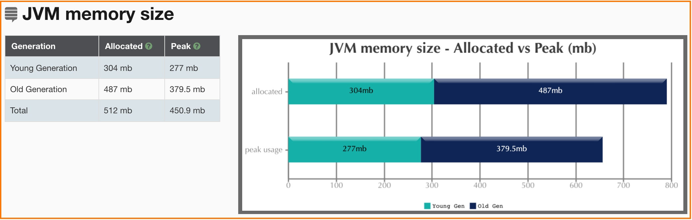
实际jvm分配的年轻代大小为：304mb，使用到内存的峰值为277mb；
实际jvm分配的老年代代大小为：487mb，使用到内存的峰值为379.5mb；

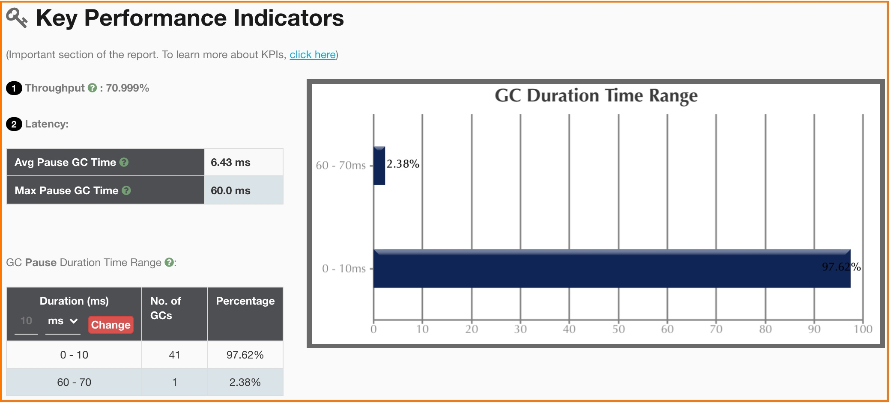
总gc次数42次，41次gc的回收时间在10ms以内；1次gc时间在60～70ms内。

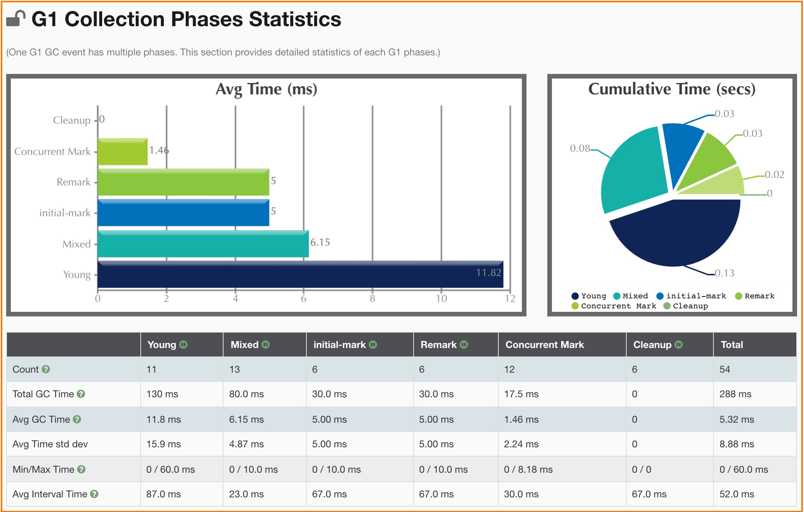
Evacuation Pause: young (纯年轻代模式转移暂停)
Concurrent Marking (并发标记)
阶段1: Initial Mark (初始标记)
阶段2: Root Region Scan (Root区扫描)
阶段3: Concurrent Mark (并发标记)
阶段4: Remark (再次标记)
阶段5: Cleanup （清理）
Evacuation Pause(mixed) (转移暂停：混合模式)
Full GC (Allocation Failure)

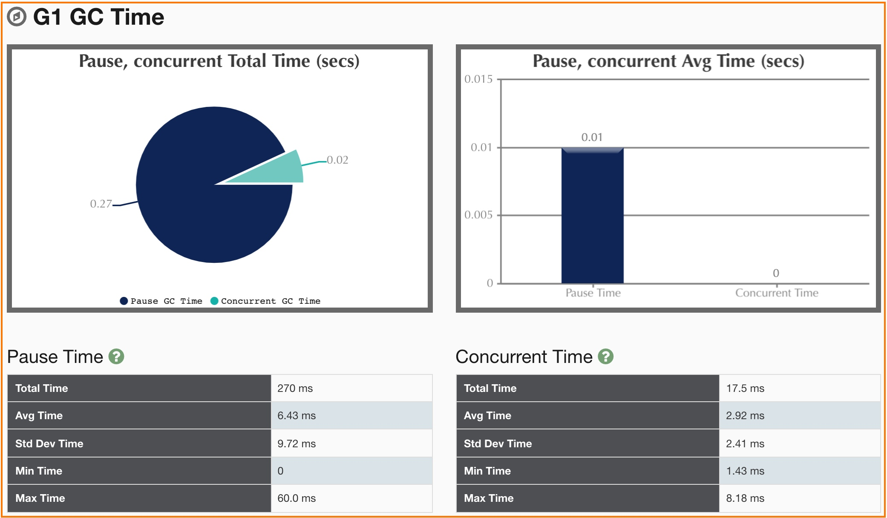

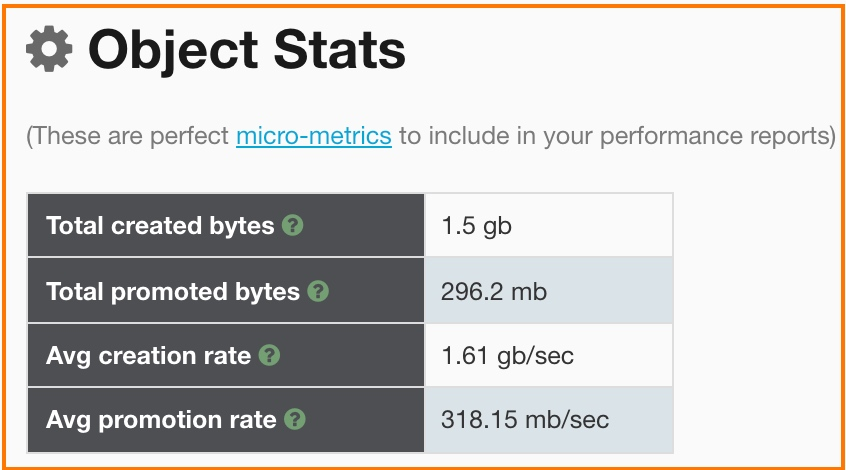
应用总创建的字节数为1.5gb；其中有296.2mb大小的数据从年轻代晋升到了老年代；应用中对象创建的平均速率为1.61gb/sec；平均晋升速率318.15mb。

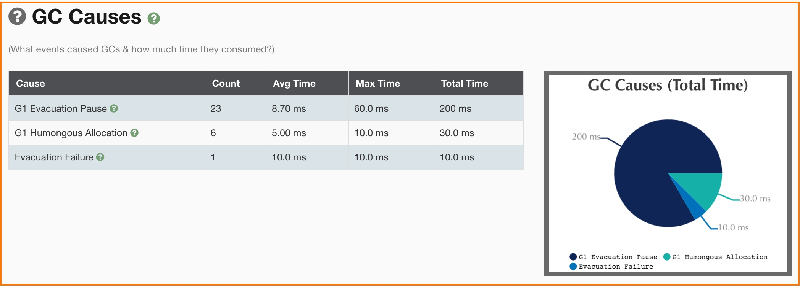
由于`G1 Evacuation Pause`导致的GC，一共23次，平均gc时间8.7ms，最大gc时间60ms，总gc时间200ms;
由于`G1 Humongous Allocation`导致的GC，一共6次，平均gc时间5ms，最大gc时间10ms，总gc时间30ms;
由于`Evacuation Failure`导致的GC，一共1次，平均gc时间10ms，最大gc时间10ms，总gc时间10ms;
> G1 Evacuation Pause: This GC is triggered when copying live objects from one set of regions to another set of regions. When Young generation regions are only copied then Young GC is triggered. When both Young + Old regions are copied, Mixed GC is triggered.
> G1 Humongous Allocation are allocations that are larger than 50% of the region size in G1. Frequent humongous allocations can cause couple of performance issues: 1.If the regions contain humongous objects, space between the last humongous object in the region and the end of the region will be unused. If there are multiple such humongous objects, this unused space can cause the heap to become fragmented.2.Until Java reclamation of humongous regions were only done during full GC events. Where as in the newer JVMs, clearing humongous objects are done in cleanup phase.
> Evacuation Failure: When there are no more free regions to promote to the old generation or to copy to the survivor space, and the heap cannot expand since it is already at its maximum, an evacuation failure occurs. For G1 GC, an evacuation failure is very expensive.


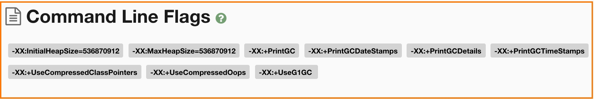
该应用启动的时候所使用的命令行参数。
